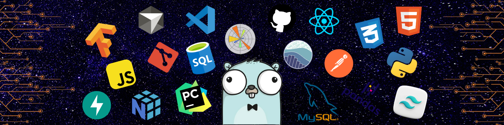

<!-- 

 -->

<!--  -->

 
   
  

- 👨‍💻 I'm currently exploring Python **data-related** frameworks! 📊
- 🚀 Additionally, I'm immersing myself in **AI & Data Science**. ⚙️
- 📚 I’m more interested in **Backend** technologies. 📤
- 💪🏼 Future Goals:
    - I dedicate myself to sharpening my **problem-solving** skills to become a proficient developer. 🌌
    - Learn Python data-related frameworks as a foundation for **AI and Data Science**. ⏱️
- ⚡ Fun fact: I'm Mr. Nobody 🤷‍♂️

# 💻Tech Stack  

